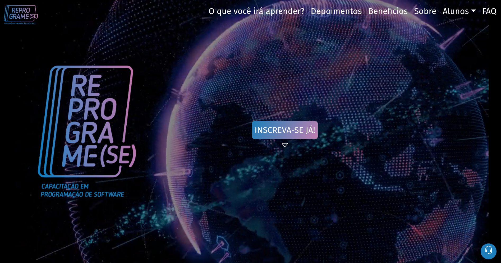

# HACKATHON REPROGRAME-SE  

 

## 📚 Sobre o projeto 

Olá! Seja bem-vindo ao readme do projeto desenvolvido durante o hackathon do curso Reprograme-se!

O Reprograme-se é um curso incrível que me ensinou as bases da programação para web front-end. Durante o curso, aprendi sobre HTML, CSS e JavaScript, além de outras tecnologias essenciais para a criação de sites e aplicações web.

Durante o hackathon do Reprograme-se, tivemos um curto período de tempo para criar um projeto usando as habilidades que adquirimos no curso. Apesar de alguns imprevistos que surgiram no caminho, trabalhamos duro e desenvolvemos um projeto incrível que nos garantiu a segunda colocação na competição.

Foi uma experiência incrível trabalhar em equipe e aprender a trabalhar sob pressão e prazos apertados. O hackathon nos desafiou a colocar em prática tudo o que aprendemos durante o curso e a trabalhar de forma colaborativa em um projeto real.

Estou muito orgulhoso de ter participado do hackathon do Reprograme-se e de ter ajudado a criar um projeto que demonstrou o nosso aprendizado e habilidades. O curso e o hackathon foram experiências enriquecedoras que me ajudaram a crescer profissionalmente e a desenvolver minhas habilidades de programação.

 

## 🖥️ Tecnologias utilizadas

* HTML
* CSS
* JavaScript
* BootStrap